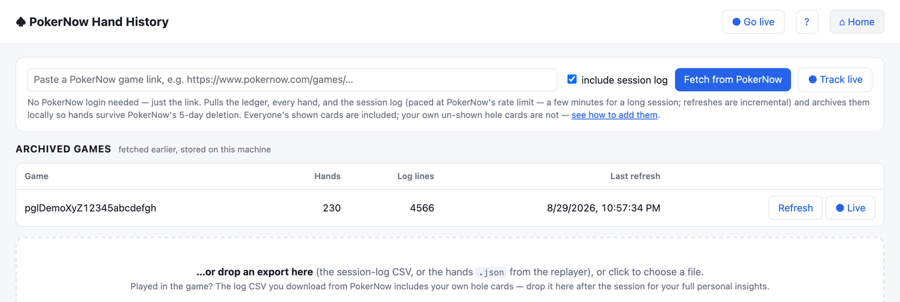
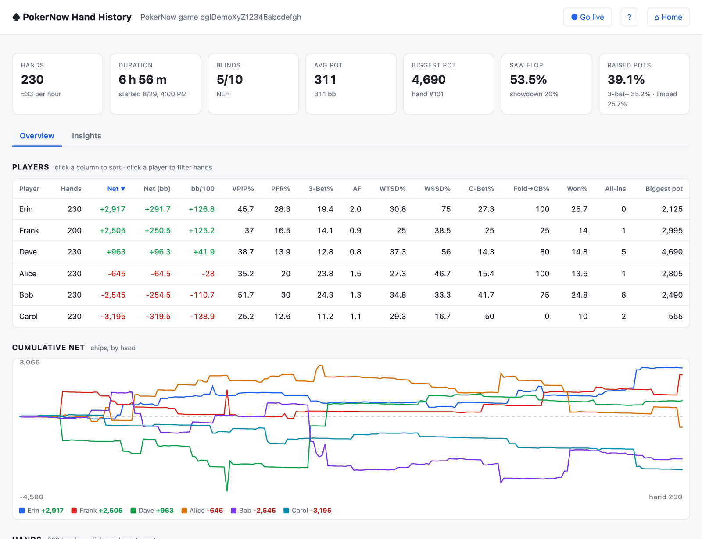
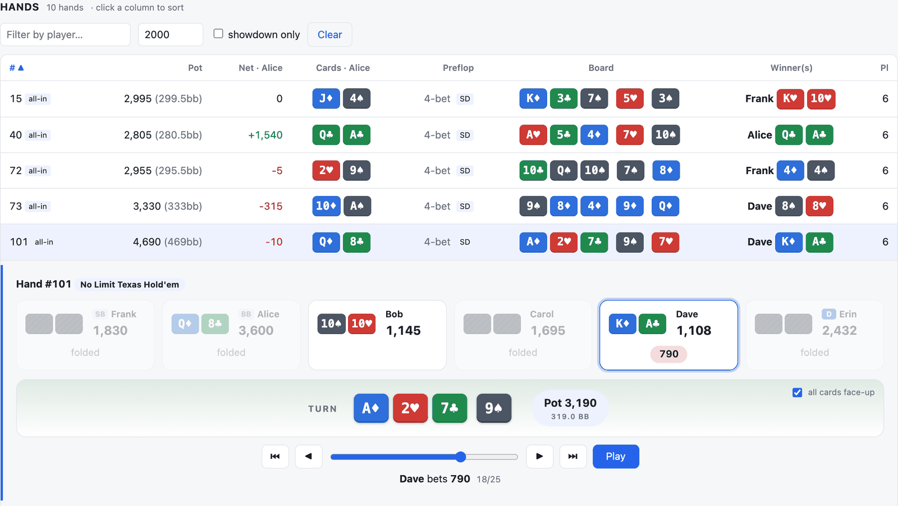
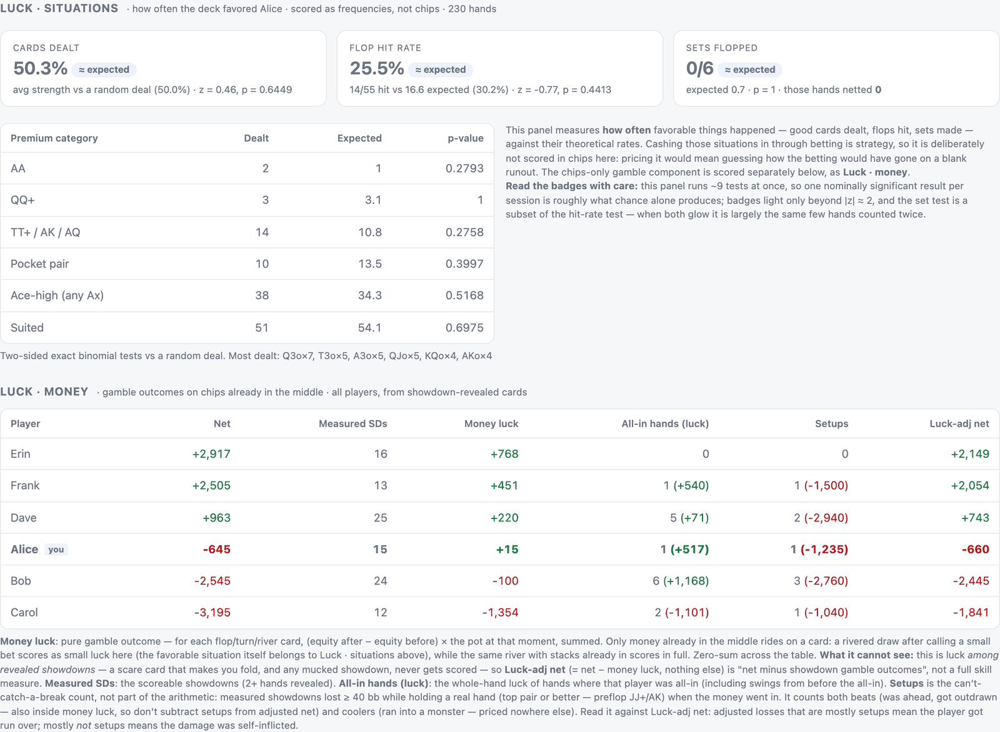
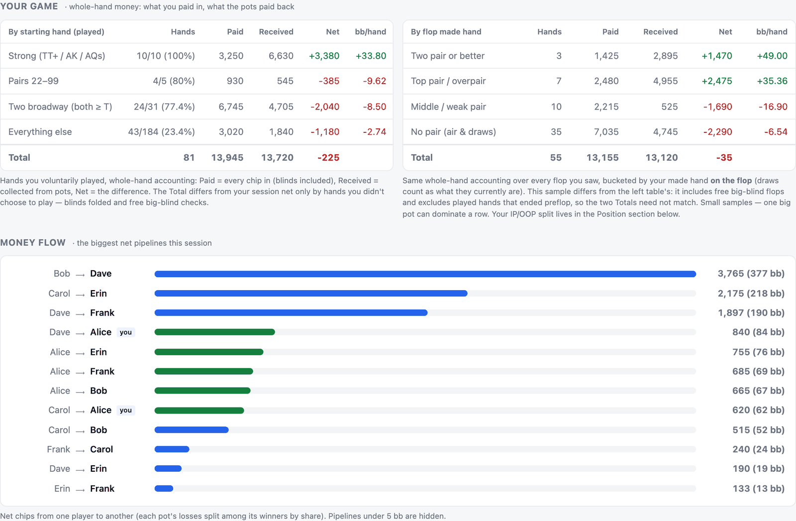

# PokerNow hand-history tool

Fetch, live-track or import [PokerNow](https://www.pokernow.com) (a.k.a. pokernow.club) hand histories, replay hands, and compute per-player statistics (VPIP, PFR, 3-bet, AF, WTSD, W$SD, c-bet, net chips, bb/100…) plus deterministic **insights**: dealt-card quality tests, street-by-street card luck, setup ("hit by a train") counts, positional ledgers and a money-flow map — see [The Insights tab](#the-insights-tab-definitions--methodology).

Python 3.11+, FastAPI backend, zero-dependency web UI, and a CLI.

## Screenshots

*All images below come from a simulated session with fictional players, not from a real game.*

**Home** — paste a game link to fetch or live-track it, pick an archived game, or drop an export.



**Overview** — session cards, sortable per-player stats, cumulative net by hand.



**Hands & replayer** — filterable hand list with every revealed hole card; click a hand to step through it street by street.



**Insights · luck** — dealt-card and flop-hit frequencies tested against theoretical rates (hero only), and money luck priced on committed chips for every player, with the *Setups* counter and luck-adjusted net.



**Insights · your game & money flow** — whole-hand ledgers by starting hand and by flop made hand, plus the largest net pipelines between players.



## Setup

```bash
uv venv && uv pip install -e ".[dev]"
```

(or `python -m venv .venv && .venv/bin/pip install -e ".[dev]"`)

## Quick start (macOS)

Double-click **`PokerNow.command`**. First run creates the virtualenv; then it starts the web UI and opens it in your browser. Paste a game link → *Track live* (while you play) or *Fetch* (afterwards) — no PokerNow login needed. All data lands in `data/<gameId>/` next to the launcher. To include your own un-shown hole cards, click the **?** in the web UI: either drop PokerNow's log CSV on the home screen after the session, or paste your `npt` login cookie for live tracking with your cards. Optional settings go in `.env` (see `.env.example`), e.g. `POKERNOW_NPT` for the CLI.

## How data flows

```
PokerNow game ──(fetch / live poll)──▶ data/<gameId>/          ◀── one folder per table id
                                        ├─ poker-now-hands-game-<id>.json   raw hands (PokerNow format)
                                        ├─ poker_now_log_<id>.csv           raw session log
                                        ├─ ledger-<id>.json                 raw ledger
                                        ├─ meta.json                        fetch bookkeeping
                                        ├─ stats.json · players.csv         derived: stats (machine readable)
                                        ├─ hands.csv                        derived: one row per hand
                                        └─ summary.md                       derived: readable digest
```

* **Live** (`pokernow live <link>` or the ● Track live button) polls every 15 s: hand list → new finished hands → log tail. A hand still in progress is never written.
* **Fetch** (`pokernow fetch <link>` or the Fetch button) does the same once, paging through everything that is missing.
* Both go through the same incremental `GameArchive.refresh`, dedupe by hand id / log `order`, take a per-folder lock and write atomically — so live-during-the-game and a fetch-afterwards (or a second machine's export dropped in) never duplicate anything; they just fill gaps.
* The derived files are regenerated after every change, so pointing another tool (or an LLM) at `data/<gameId>/` always gives it current, self-describing records. Raw files are the source of truth; derived files can be deleted and rebuilt with `pokernow export`.

## Three ways to get a game in

### 1. From the game link (recommended)

```bash
pokernow fetch https://www.pokernow.com/games/<gameId>      # once, afterwards
pokernow live  https://www.pokernow.com/games/<gameId>      # keep polling while the game runs
```

Pulls, straight from PokerNow's own endpoints (no CAPTCHA, no copy/paste):

| What | Endpoint used | Needs login? |
|---|---|---|
| Ledger (buy-ins / cash-outs / net) | `/games/{id}/players_sessions` | no |
| Every hand (structured JSON, `handVersion 2`) | `/api/hand-replayer/game/{id}` + `/api/hand-replayer/hand/{handId}` | no — but **your own un-shown hole cards** only appear when logged in |
| Session log (table events, rebuys, admin actions…) | `/games/{id}/log?after_at&before_at` | no — `Your hand is …` lines only when logged in |

Archives live under `./data/<gameId>/` when started from `PokerNow.command`, else `~/.pokernow/games/<gameId>/` (override with `--data-dir` or `POKERNOW_DATA_DIR`), so hands survive PokerNow's **5-day deletion**.

PokerNow rate-limits at ~2 requests/second; the client paces itself, so a 450-hand session takes ~5 minutes the first time (`--no-log` roughly halves it); a live poll with no new hands is 2 requests. The same works in the web UI.

**Including your hole cards.** Everything table-wide works anonymously; only your *own un-shown* hole cards need one of:

1. **Upload the log CSV after the session** (easiest): the log you download from PokerNow while logged in already contains your `Your hand is …` lines — drop it on the web UI's home screen.
2. **Paste your login cookie in the web UI** (for live tracking with your cards): click **?** in the header. PokerNow identifies you by the `npt` cookie — copy its value from your browser (DevTools → Application → Cookies → pokernow.com → `npt`). Kept in server memory only, never written to disk; after pasting it, use *re-download this game* to backfill cards into hands fetched earlier.
3. **`POKERNOW_NPT` env var / `.env`** — same cookie, for the CLI or set before starting the server.

### 2. The replayer's hands `.json`

Hand Replayer → "Hands are deleted after 5 days… download them by clicking here" gives `poker-now-hands-game-<id>.json`. Drop it into the web UI or run `pokernow stats file.json`. It is the same data the fetcher gets, plus your hole cards and `playerNet` (because you were logged in).

### 3. The session-log CSV

Ledger → Download log (or copy/paste of the log page) gives the `entry,at,order` CSV. Also accepted everywhere. It has the table-lifecycle events the JSON lacks.

Stats computed from the JSON and the CSV of the same game are identical (verified on a 448-hand session); given both, the tool merges them (`combine_sessions`).

## CLI

```bash
pokernow fetch  <game-url|id> [--no-log] [--data-dir DIR]
pokernow live   <game-url|id> [--interval 15]      # poll while the game runs (Ctrl-C to stop)
pokernow export <file-or-archive-dir>              # (re)write stats.json / players.csv / hands.csv / summary.md
pokernow stats  <file-or-archive-dir> [--json]     # per-player stats table
pokernow hands  <file-or-archive-dir> --min-pot 500 --player Alice
pokernow hand   <file-or-archive-dir> 42           # replay hand #42
pokernow unparsed <file-or-archive-dir>            # lines the parser didn't understand
pokernow serve --port 8000                         # web UI + API
```

`<file-or-archive-dir>` is a `.csv` log, a hands `.json`, or an archive directory such as `~/.pokernow/games/<gameId>`.

## Web UI / API

```bash
pokernow serve
```

Open http://127.0.0.1:8000: paste a game link (progress bar, then the dashboard), click an archived game, or drop a file. The dashboard has two tabs:

* **Overview** — session summary cards, a sortable player stats table, a cumulative-net chart, and a filterable, paginated hand list (15 per page; tags for bomb pots / double boards / run-it-twice) with a street-by-street replayer showing every revealed hole card.
* **Insights** — the deterministic analysis layer: luck split into *situations* vs *money*, per-player run-good meter, positional ledgers, and money-flow pipelines. Definitions below.

The ♠ title (or **⌂ Home**) returns to the add-a-game / archives screen.

API (interactive docs at `/docs`):

| Method | Path | Description |
|---|---|---|
| POST | `/api/fetch` `{url, log, hands, ledger}` | start a background fetch → job |
| GET | `/api/fetch/{job}` | progress / result (`session_id` when done) |
| POST | `/api/live` `{url, interval}` · GET `/api/live[/{gameId}]` · POST `/api/live/{gameId}/poll` · DELETE `/api/live/{gameId}` | live tracking (state has a `version` that bumps on change) |
| GET | `/api/archives/{gameId}/files` | paths of raw + derived files |
| GET | `/api/archives` · POST `/api/archives/{gameId}/load` | archived games |
| POST | `/api/sessions` | multipart upload (`file`: .csv or .json) |
| GET | `/api/sessions` · `/api/sessions/{id}` | list / summary + player stats |
| GET | `/api/sessions/{id}/players[/{name}]` | player stats (+ their hands) |
| GET | `/api/sessions/{id}/hands?player=&min_pot=&showdown=&limit=&offset=` | hand summaries |
| GET | `/api/sessions/{id}/hands/{n}` | full hand (seats, actions, boards, known cards, net) |
| GET | `/api/sessions/{id}/insights` | everything on the Insights tab (cached per session version) |
| GET | `/api/sessions/{id}/events` · `/unparsed` | table events / skipped lines |
| DELETE | `/api/sessions/{id}` | forget a session |

## Library

```python
from pokernow.parser import parse_file, load_archive
from pokernow.stats import compute_session_stats

session = parse_file("game.json")            # or .csv, or load_archive("~/.pokernow/games/<id>")
stats = compute_session_stats(session)
for p in stats.players:
    print(p.name, p.net, p.vpip, p.pfr)
hand = session.hands[0]
print(hand.board, hand.pot, hand.net(hand.players[0]), hand.known_cards)

from pokernow.insights import compute_insights, equities, card_int
ins = compute_insights(session, stats.big_blind)   # everything the Insights tab shows
print(ins["quality"], ins["luck"], ins["flow"])
print(equities([[card_int("As"), card_int("Ad")], [card_int("Ks"), card_int("Kd")]], []))
```

## What the parsers understand

**CSV log** — hand start/end (old and new formats, dealer or dead button), player stacks, hero cards, blinds / missed blinds / straddles / antes / bomb-pot posts, fold/check/call/bet/raise (incl. `and go all in`; amounts are *totals on the street*, as PokerNow logs them), flop/turn/river incl. run-it-twice (`second run`) and double board (`second board`), rabbit-hunt `Undealt cards`, uncalled bets, `collected … with <hand> (combination: …)`, shows (also post-hand voluntary shows), run-it-twice prompts, and table events (join, approve, quit, stand up, sit back, rebuy request/rebought, admin stack updates, removal, game stop, config changes, and **player ID changes** — the same person under two IDs is merged). Unknown lines are kept per hand/session and surfaced, never silently dropped.

**Hands JSON** — `handVersion 2`, every event type in PokerNow's enum (CHECK/BET/…/RAKE_VALUE/NIT_*), bomb pots, double boards, run-it-twice, rake, and `playerNet` (used as a cross-check: parsed hero net must equal it).

Chip conservation (`collected + rake == pot`) is tested and surfaced per hand (`chip_mismatch`).

## Stat definitions

- **VPIP** – voluntarily put chips in preflop (call/bet/raise; blinds, straddles and bomb-pot posts don't count).
- **PFR** – raised preflop.
- **3-Bet%** – re-raised when facing exactly one raise / opportunities to do so.
- **AF** – (bets + raises) / calls across all streets.
- **WTSD%** – went to showdown / saw flop. **W$SD%** – won chips at showdown / went to showdown.
- **C-Bet%** – last preflop aggressor bet the flop when first to act aggressively. **Fold→CB%** – folded to that c-bet.
- **Net / Net(bb) / bb per 100** – chips won minus chips put in (uncalled bets excluded).

## The Insights tab: definitions & methodology

Everything in `src/pokernow/insights.py` is deterministic — no judgement calls, no
tunable models — so it can recompute live during a session and give the same
answer every run. Equity comes from **exact runout enumeration** once a flop is
out (990 flop→river boards, 44 turn→river) and a fixed-seed 2,000-iteration
Monte Carlo preflop. The 7-card evaluator is cross-checked against an
independent brute-force implementation (80k random hands in tests + verification,
zero mismatches).

### The core idea: luck is two different things

* **Luck · situations** — *how often* favorable things happened: good cards
  dealt, flops hit, sets made. Scored as **frequencies against theoretical
  rates**, never as chips: converting "I kept flopping sets" into money would
  require guessing how betting would have gone on a blank runout. Hero-only —
  it needs every dealt hand, which only your own cards provide
  (opponents' cards are only visible at showdown, a sample too biased to
  estimate frequencies from).
* **Luck · money** — the pure gamble outcome on chips already committed,
  computable for **every player** from showdown-revealed cards.

Cashing a good situation in through betting is strategy and is deliberately in
neither bucket. There is intentionally **no combined "total luck" number** — the
two channels don't share a unit that can be added honestly.

### Luck · situations (hero only)

* **Cards dealt** — each starting hand is scored by its equity vs one random
  hand (`PRE_EQ`, a built-in 169-class table generated by 20,000-iteration
  fixed-seed MC per class; combo-weighted mean 0.50006, verified against an
  independent 100k-iteration run). The session mean is z-tested against the
  random-deal null: mean 0.5004, SD 0.0991, `z = (mean − μ₀)/(σ₀/√n)`.
* **Premium categories** — dealt counts of AA, QQ+, TT+/AK/AQ, pocket pairs,
  Ax, suited vs their exact combinatorial probabilities, each with an exact
  two-sided binomial p-value (sum of all outcomes no more likely than the
  observed one).
* **Flop hit rate** — over hands where you saw the flop: an unpaired hand
  "hits" when a hole-card rank appears among the flop's three cards
  (`p₀ = 1 − C(44,3)/C(50,3) ≈ 29.4%`); a pocket pair hits when it flops a set
  (`p₀ = 1 − C(48,3)/C(50,3) ≈ 11.8%`). Observed hits vs the sum of per-hand
  `p₀` gives a normal-approximation z (variance `Σ p₀(1−p₀)`).
* **Sets** — flopped sets vs expectation with an exact binomial p, plus
  sets by the *dealt* board (expectation uses each hand's actual board length,
  so hands that ended on the flop aren't held to a 5-card standard), and the
  net chips of the set hands — a descriptive bridge showing where frequency
  luck landed, without claiming how much of that money "is" luck.
* Hand-by-hand *selection* (what you chose to play per category) lives in the
  **Your game** table below rather than here — it is skill, not luck.

**Multiple comparisons.** This panel runs ~9 hypothesis tests side by side, so
one nominally significant result per session is roughly what chance alone
produces. Badges therefore only light beyond |z| ≈ 2 (binomial p < 0.05), and
they are per-test — a single glowing badge is weak evidence of anything. The
set test is a *subset* of the flop-hit test: when both glow, it is largely the
same few hands counted twice, not two independent signals.

### Luck · money (all players)

For every **measurable showdown** — 2+ survivors with known hole cards, a
single-run 5-card board, no duplicated cards — each card reveal is priced on
the money that was already in the middle:

```
luck = (eq_flop − eq_pre)   × pot when the flop was dealt      (the preflop pot)
     + (eq_turn − eq_flop)  × pot when the turn was dealt
     + (eq_river − eq_turn) × pot when the river was dealt
```

Only committed money rides on a card: a rivered gutshot after calling a tiny
turn bet scores tiny luck (the big river bet you then win is payoff, not luck),
while the same river with stacks already in scores in full. Equities are
computed only among the known survivors. Luck is **zero-sum across the table**
by construction (verified to 1e-13 per hand).

Columns:

* **Measured SDs** — showdowns that could be scored. Mucked showdowns are
  invisible, so every row understates a little.
* **Money luck** — the sum above (hover for bb).
* **All-in hands (luck)** — the whole-hand luck of hands where the player was
  all-in at some point, including swings from before the all-in.
* **Setups** — the *can't-catch-a-break* counter, an annotation outside the
  arithmetic: measured showdowns lost for **≥ 40 bb** while holding a **real
  hand when the money went in** — top pair / overpair / two-pair-using-a-hole-card
  / straight-or-better on the street where they committed the most chips
  (ties go to the later street); preflop commits count JJ+ and AK. It counts
  both beats (was ahead — also in money luck) and coolers (ran into a monster —
  priced nowhere else). Read against Luck-adj net: adjusted losses that are
  mostly setups = run over; mostly not = self-inflicted. Because beats sit in
  both numbers, setups and adjusted net overlap — compare them, never subtract
  one from the other (setup chips can legitimately exceed the adjusted loss).
  Definitional edges: "top pair" ignores the kicker, and on a board that plays
  itself a straight/flush can count as a "real hand" — both err on the generous
  side.
* **Luck-adj net** — `net − money luck`, nothing else. It is *not* a skill
  measure: it removes only the gamble outcomes of revealed showdowns.

Known approximations and structural limits:

* **Fold truncation** — a scare card that makes a player fold is never scored:
  the luck of that card on the existing pot happened, but the hand ends
  unmeasured (the folder's cards are unknown anyway). Money luck is luck
  *conditional on reaching a revealed showdown*, not total card luck.
* **Within-hand survivorship** — equities are computed between the eventual
  showdown hands only; in multiway pots, players who folded on earlier streets
  had claims on the pot when a card fell, so early-street terms are
  approximations (exact for pots that are heads-up by the flop, which most big
  pots are).
* Side pots are ignored (equity × full pot, slightly wrong when a short stack
  is all-in multiway); run-it-twice and double-board hands are excluded; the
  preflop equity term uses the fixed-seed MC (±1% on the smallest pot of the
  hand); mucked showdowns are invisible, understating every row a little.

### Position

No hole cards needed, so it covers **every player and every flop-seen,
non-bomb-pot hand**: among the players who saw the flop, the one acting last
postflop is IP, everyone before is OOP. Table-wide totals plus a per-player
IP/OOP net table (bb/hand). IP and OOP don't sum to zero — preflop folders'
blinds are in those pots. Per-player rows are verified to sum exactly to the
table totals.

**Read it as a ledger, not a causal estimate of positional skill.** IP/OOP
assignment is not a randomized experiment: the OOP pool carries the blind tax
and forced defends with weak ranges, while the IP pool holds freely chosen
(stronger) entries — so everyone looks better IP, and the gap mixes position,
range and blind money. A player's OOP number is meaningful relative to the
table's OOP baseline, not relative to zero.

### Money flow

Each pot's losses are attributed to its winners in proportion to their share
of the winnings; the UI shows the largest pairwise **net** pipelines
(`A ⟶ B`, hidden under 5 bb). Conservation is exact: for every player,
`(sum won from others) − (sum paid to others) = net`, and rebuilt per-hand nets
match PokerNow's own ledger to the chip on the sessions tested.

### Your game: two whole-hand ledgers

Both hero-only, both plain double-entry over whole hands — **Paid** (every
chip put in, blinds included, uncalled bets excluded), **Received** (collected
from pots), **Net** = the difference — with a Total row so the numbers
visibly reconcile (Total net + blinds lost on folded hands = session net):

* **By starting hand** — hands you voluntarily played, grouped as **Strong**
  (TT+ / AK / AQs), **Pairs 22–99**, **Two broadway** (both ≥ T) and
  **Everything else**; the played/dealt ratio shows selection, and the
  "Everything else" row is where limp discipline shows.
* **By flop made hand** — the same ledger over hands where you saw the flop,
  bucketed by the made hand **on the flop**: two pair or better / top pair or
  overpair / middle-weak pair / no pair (draws count as what they currently
  are).

Finer buckets are deliberately not offered — at 200 hands they are
one-big-pot noise.

### What it deliberately cannot tell you

* Opponents' *frequency* luck ("does he always flop sets?") — their unplayed
  and mucked hands are unobservable, and showdown hands are selection-biased
  in a way no statistic repairs. The Setups count is the honest substitute.
* Whether a call was justified by implied odds — that's a judgement about
  opponents' future behavior, i.e. coaching, not measurement.
* Tilt as a number — losses after a beating are decisions and stay in the
  adjusted net; the Setups column shows you the matches that lit the fire.

## Tests

```bash
.venv/bin/python -m pytest
```

`tests/fixtures/make_fixture.py` regenerates the sample log; `tests/test_json_parser.py` builds its own JSON fixture; `tests/test_fetch.py` stubs HTTP (no network). `tests/test_insights.py` cross-checks the hand evaluator against a brute-force reference, pins exact equity cases (including a hand-derived 7-outs-in-44 turn spot), and runs end-to-end insight scenarios — among them the one that motivated the luck design: a rivered gutshot in a tiny pot followed by a big winning river bet must score as small luck, not a big one.

## Privacy & data

Everything runs and stays on your machine: game archives are plain files under `data/` (or `~/.pokernow/games/`), nothing is sent anywhere except the requests to PokerNow itself, and the optional `npt` login cookie is held in server memory only — never written to disk. Treat the cookie like a password; it is your PokerNow identity.

The fetcher uses only PokerNow's own public per-game endpoints, respects its ~2 req/s rate limit, and needs no login for anything table-wide.

## License

[MIT](LICENSE). This is an independent community tool, not affiliated with or endorsed by PokerNow.
